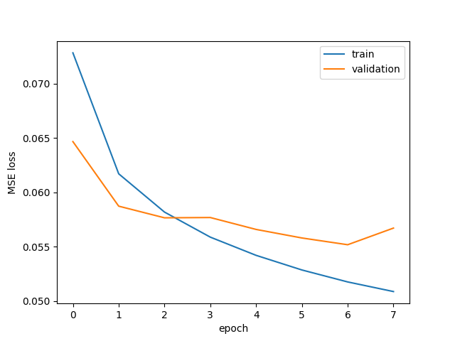

# Chess Engine

A chess engine that evaluates positions with a convolutional neural network trained on
Stockfish evaluations, and selects moves with negamax search using alpha-beta pruning,
quiescence search, and MVV-LVA move ordering.

Built in Python as a project to learn machine learning fundamentals from scratch.

---

## Results

**Against a random-move player:** 10 wins in 10 games at depth 2, alternating colours, no draws.

**Against itself with the neural network removed** — identical search, identical endgame
heuristics, evaluation reduced to material count only — the learned evaluator scored:

| | Wins | Losses | Draws |
|---|---|---|---|
| Network + heuristics vs. heuristics only | 7 | 1 | 12 |

20 games at depth 2 from randomized 4-ply openings. The network wins the large majority of
decisive games, though with a sample this small the margin carries real uncertainty. The high
draw rate reflects that neither configuration can reliably convert an advantage at depth 2.

**Model quality:** final validation loss 0.0445 MSE on normalized evaluations, corresponding to
roughly 210 centipawns of typical error.

**Estimated playing strength:** somewhere around 1000, but this is an informal impression from
casual play rather than a measured rating. The only game against a rated opponent was a loss to a
1500-rated chess.com bot.

### Training curve



Validation loss flattened and became noisy after epoch 4 while training loss continued to fall
steadily — the model had started fitting specifics of the training set rather than learning
transferable patterns. Best-validation checkpointing means the saved weights are from epoch 6,
before the divergence widened.

### Search timings (depth 3, M-series MacBook Air)

| Position type | Move chosen | Time |
|---|---|---|
| Opening (start position) | h3 | 0.51s |
| Developed middlegame | h4 | 8.37s |
| Tactical (captures available) | Qf6 | 4.80s |
| Endgame (few pieces) | Ra8+ | 0.31s |

---

## How it works

Two halves: a **learned evaluator** that judges how good a position is, and a **search** that
looks ahead through move sequences and calls the evaluator at the leaves.

### 1. Board encoding (`src/encode.py`)

A neural network takes numbers, not chess positions, so every board becomes a `(17, 8, 8)`
float32 tensor:

- **Planes 0–5:** white pawn, knight, bishop, rook, queen, king — one 8×8 plane each, with a 1
  where that piece stands
- **Planes 6–11:** the same for black
- **Plane 12:** side to move (all 1s for White)
- **Planes 13–16:** castling rights (white kingside, white queenside, black kingside, black queenside)

One plane per piece type rather than a single grid of piece IDs, because numeric IDs would imply
an ordering the network would have to unlearn — a bishop is not "one more than" a knight.
Single-bit facts like side-to-move get a whole plane so the input stays a uniform stack, which is
what convolutional layers expect.

### 2. Data pipeline (`src/dataset.py`)

Training data is the [Chess Evaluations dataset](https://www.kaggle.com/datasets/ronakbadhe/chess-evaluations)
by Ronak Badhe — roughly 12.9 million positions in FEN notation with Stockfish depth-22
evaluations in centipawns.

Three transformations:

- **Mate scores** (`#+3`, `#-5`) become ±10000 centipawns. Distance to mate is discarded because
  everything gets clamped immediately afterwards — mate-in-3 and mate-in-8 both land on the ceiling.
- **Clamping to ±1000 centipawns.** Past ten pawns of advantage the exact number carries no useful
  signal, and extreme targets destabilize training.
- **Side-to-move relative labels.** The dataset scores everything from White's perspective; labels
  are negated when it's Black's turn, so positive always means "good for whoever moves next." This
  gives the network one consistent concept to learn and is what makes negamax possible in search.

Labels are then divided by 1000 to land in [-1, 1], matching the network's `tanh` output.

Positions are encoded lazily inside `__getitem__` rather than up front — encoding all 13M
positions at once would need roughly 56 GB.

### 3. Model (`src/model.py`)

```
input (17, 8, 8)
  → Conv2d(17 → 32, 3×3, pad 1) → ReLU
  → Conv2d(32 → 64, 3×3, pad 1) → ReLU
  → Conv2d(64 → 64, 3×3, pad 1) → ReLU
  → Flatten (4096)
  → Linear(4096 → 256) → ReLU
  → Linear(256 → 1)
  → Tanh
```

1,109,441 parameters. The convolutions preserve the 8×8 shape and enrich the channel dimension;
each layer's receptive field widens (3×3 → 5×5 → 7×7) so deeper layers see larger board regions.
The linear layers then aggregate those features into a single evaluation. About 85% of the
parameters sit in the first linear layer — the usual cost of fully-connected layers, which share
no weights.

### 4. Training (`src/train.py`)

- 1M positions, 90/10 random train/validation split
- Batch size 256, MSE loss, Adam at lr 1e-3, 8 epochs
- Best-validation checkpointing, so later overfitting epochs can't degrade the saved model

Data scale turned out to matter in both directions. An earlier run on 100k positions overfit
sharply from epoch 4 — training loss halved while validation flattened. Scaling to 1M delayed
that considerably. A 5M run went the other way and *underfit*: training loss never dropped below
0.051, indicating the model had run out of capacity rather than data.

### 5. Search (`src/search.py`)

**Negamax.** Because evaluations are side-to-move relative, a position's value for one player is
exactly the negation of its value for the other. That collapses minimax's alternating
maximize/minimize into one rule at every node: take the maximum over `-search(child)`.

**Quiescence search.** A static evaluator can't be trusted on a position where captures are
pending — it will report "up a pawn" one ply before the recapture. At depth 0 the search keeps
going, considering captures only, until the position is quiet. A "stand-pat" floor means the
engine can decline to capture, so it isn't forced into bad exchanges.

Measured effect: on a position with a hanging queen, static evaluation returned −0.378 and
quiescence returned +0.102 — roughly a queen's worth of swing, correctly recognizing that the
side to move simply takes it.

**Alpha-beta pruning.** Branches that provably cannot affect the result are skipped, returning
*identical* scores to plain negamax. Verified directly:

```
negamax:   -0.018353 in 51.0s
alphabeta: -0.018353 in  9.7s
```

**MVV-LVA move ordering.** Alpha-beta prunes hardest when good moves come first, so moves are
sorted with captures ahead of quiet moves, scored `10 × victim_value − attacker_value`. On the
tactical benchmark position this cut depth-3 search from 40.0s to 6.5s. In closed positions with
no captures it costs slightly more than it saves — sorting overhead buys nothing when every move
scores zero.

**Hybrid evaluation.** The network alone was badly miscalibrated on material: a hanging queen
registered as roughly 250 centipawns rather than 900. MSE regression on noisy targets pulls
predictions toward the mean, and `tanh` compresses the extremes further, so the model learned to
hedge. The fix was to add an exact material count to the network's output rather than relying on
it to infer material it had learned to be vague about.

The difference was stark. In one test position the engine ranked a move that hung a bishop as its
**best** option out of 25 candidates; after adding material balance the same move ranked **22nd**,
and the spread across candidates widened from 0.2 to nearly 1.0.

**Endgame heuristics.** The network's training data is overwhelmingly middlegame positions, so it
had no endgame concept at all — games would run to the ply cap with both sides shuffling. Two
hand-written terms address this:

- *Passed pawns:* a bonus scaling with advancement for pawns no enemy pawn can block or capture
- *King activity:* a centralization bonus, gated to activate only once non-pawn material drops
  below a threshold, since a centralized king in the middlegame is a liability

**Opening book.** All twenty first moves sit within about 30 centipawns of each other, well inside
the evaluator's ~210 centipawn noise floor — the network genuinely cannot tell them apart, and no
search depth fixes that. A [polyglot opening book](https://github.com/michaeldv/donna_opening_books)
is consulted before searching, which is why the engine plays real openings instead of 1.Nh3.

---

## Setup

```bash
git clone https://github.com/TysonWoerdehoff/chess-engine.git
cd chess-engine
python -m venv venv
source venv/bin/activate          # Windows: venv\Scripts\Activate.ps1
pip install -r requirements.txt
```

The trained model (`models/chess_net.pt`) and opening book (`data/gm2001.bin`) are included, so
you can play immediately:

```bash
python src/play.py
```

To retrain, download `chessData.csv` from the
[Kaggle dataset](https://www.kaggle.com/datasets/ronakbadhe/chess-evaluations) into `data/`, then:

```bash
python src/train.py
```

---

## Known limitations

- **Aimless in quiet positions.** With no captures available and material level, the evaluator's
  positional signal is smaller than its noise, so the engine shuffles without a plan.
- **Endgames are heuristic, not learned.** The passed-pawn and king-activity terms stop the worst
  of the shuffling, but the engine still draws many won positions rather than converting.
- **Depth 3 in practice.** Depth 4 costs 50–75 seconds in complex positions, too slow for casual
  play. Tactics deeper than three plies get missed.
- **All mates score alike past the search horizon.** Because evaluations are clamped, a mate-in-8
  looks identical to any other crushing position. Mates *within* the search depth are handled
  correctly with a depth-adjusted score.
- **Strength is not rigorously measured.** The benchmark results are real; the Elo estimate is not.

## Future work

Roughly in order of expected value:

- **Iterative deepening** — searching depths 1..N in sequence and trying the previous best move
  first would substantially improve move ordering, and enables time-based cutoffs
- **Transposition table** — chess transposes constantly; caching search results by Zobrist hash
  should be worth several times the current throughput
- **Killer move / history heuristics** — ordering for *quiet* moves, which is exactly where
  MVV-LVA does nothing
- **A smaller, faster evaluator.** Profiling showed evaluation splits roughly 32% board encoding
  / 68% forward pass, at ~0.27 ms per position. Global pooling before the linear layers would cut
  the parameter count dramatically at some cost in positional judgement — and depth is currently
  worth more than evaluation precision.
- **Endgame-weighted training data**, or Syzygy tablebases for perfect play with few pieces
- **Lichess bot integration** for an actual measured rating

---

## Project structure

```
src/
  encode.py     board → (17,8,8) tensor
  dataset.py    CSV loading, eval parsing, PyTorch Dataset
  model.py      ChessNet architecture
  train.py      training loop with validation and checkpointing
  search.py     evaluation, negamax, alpha-beta, quiescence, move ordering, endgame heuristics
  play.py       CLI to play against the engine
models/
  chess_net.pt  trained weights
data/
  gm2001.bin    polyglot opening book
```

## Acknowledgements

- Training data: [Chess Evaluations](https://www.kaggle.com/datasets/ronakbadhe/chess-evaluations) by Ronak Badhe (Stockfish 11, depth 22)
- Opening book: `gm2001.bin` from [donna_opening_books](https://github.com/michaeldv/donna_opening_books)
- [python-chess](https://python-chess.readthedocs.io/) for board representation and move generation
